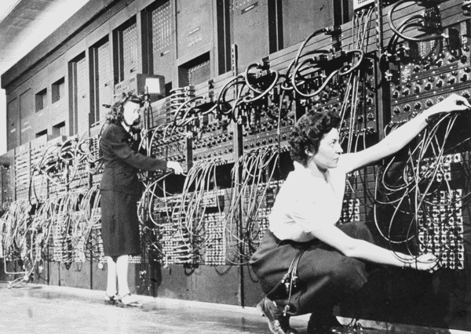
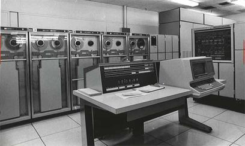

# CSE2010 Computing Science 2 Notes

## Trends in Computing Science 

**Computing Science** is the study of algorithms, including but not limited to the following: 

1. Their formal and mathematical properties. These properties are commonly referred to as **computer logic**. 

2. Their hardware applications, such as computers and everything that uses computer components. 

3. Their linguistic realization aka their *computer programming language*. 

4. Their applications.

An **algorithm** is a well ordered collection of unambiguous and effectively computable operations that, when executed, produces a result and halts in a finite amount of time. 

Note: None of these definitions rely on modern technology 

## A Brief History of Computer Science 

- before recorded time: Stonehenge is thought to be a calendar or astrological calculator. 

    

- 1700s: French mathematician *Blaise Pascal* and later, German mathematician *Gottfried Wilhem von Leibniz* invented mathematical machines that could perform basic arithmetic. 

- 1843: *Augusta Ada King, Countess of Lovelace* improves upon *Charle's Babbage's* **Analytical Engine** by inventing the algorithm loop. 

    

- 1936: *Alan M. Turing* developed the *turing machine*, which led to the development of *Colossus*, considered by many to be the first all-programmable electronic digital computer. 

- 1946: The *ENIAC* computer is unveiled. John von Neumann was a consultant on the project. The ENIAC is credited as the first modern computer. 

    
    - By the end of its operation in 1956, ENIAC contained 20k vaccum tubes, 7.2k crystal diodes, 1.5k relays, 70k resistors, 10k capaciters, and approximately 5 million hand-soldered joints. It weighted more than 30 short tons (27 tons) and filled two classrooms. 

- 1951: The UNIVAC is the first commercial computer which the US government used in their census department. 

    
    - used first generation software, where the programming language was similar to binary and programmers would program by arranging sets of zeros and ones that represented statements. 

- 1960s: Introduction of FORTRAN and COBOL, which were *high level languages*, meaning they were written with more human-like language rather than binary. 

- 1970s: Introduction of the *operating system* and *structured programming languages*. 

- late 1980s: Introduction to parallel compiling (multi-core processing). 

- late 1980s: Introduction of the *Ethernet Cable* which made it really cheap to setup networking, paving the way for the internet. 

- 1990s: Introduction of modular programs within the operating system. (MS Office, MS Paint, other installables like games, etc)

- 1990s: Introduction of OOP

### Trends in Modern Computing Technology 

- Social Media

- e-Commerce

- e-Sports

- Cryptography 

## New System Design 

- A **societal issue**, where a problem or its solution has considerable influence on individuals within a society. Current example is Artificial Intelligence affecting education, automation, media, visual arts, and more. 

* An **ethical issue** is a problem or situation that requires a person or organization to choose between alternatives that may be evaluated as *right* or *wrong*. 

* For IB, it is important to discuss how new computer systems help or hinder an issue. 

### Stakeholders 

To understand what issues may arise, relevant stakeholders must be indentified and consulted. 

* A *stakeholder* is a person, group, organization, or entity that has **interest** or **concern** in an organization. 
    * Example: The stakeholders involved in the success of your education include: 
        * You, the student 
        * Teachers 
        * Parents 
        * Principal & other admin that ensure operations within the school and individual student completion of high school. 
        * Secondary Stakeholders 
            * The school district 
            * City transportation 
            * Utilities companies (electricity, water, internet)
            * provincial government 

- Not all stakeholders are **equal**, oftentimes stakeholders are categorized as internal (primary) or external (secondary) to the entity. 

To identify internal stakeholders affected by a new system, ask the following: 

1. Who will be **affected by** the new system? 

    a) Teacher's work is affected by curriculumn change (they have to do **work** to change to the new system)

2. Who will the new system **affect**? 

    a) New system affects the students (the **results** affect them)

3. Who will the **end users** be? 

    a) New sale in store affects the sales associates who have to scan in the new sale 

4. What are the new system's **needs**? 

* Internal stakeholders tend to be directly connected to the new system on a micro-level. (they are connected without the use of multiple people)

* Social Studies Links 

    * Mutliple influences outside the system can affect how a new system is developed. 

    * Where is the money coming from? 

    * When designing a new system, not every stakeholder will receive a desireable outcome. 

    * *Utlilitarianism* is the approach where new systems results in the greatest good for the greatest number of people. Computer systems can inadvertently amplify these prejudices. 

    