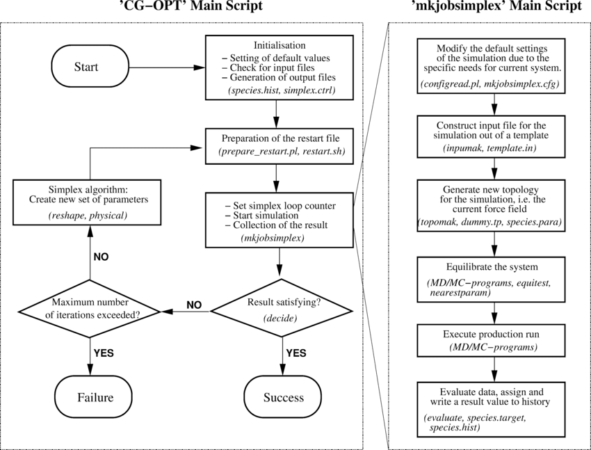

# CSE2010 Computing Science 2 Notes

## Trends in Computing Science 

**Computing Science** is the study of algorithms, including but not limited to the following: 

1. Their formal and mathematical properties. These properties are commonly referred to as **computer logic**. 

2. Their hardware applications, such as computers and everything that uses computer components. 

3. Their linguistic realization aka their *computer programming language*. 

4. Their applications.

An **algorithm** is a well ordered collection of unambiguous and effectively computable operations that, when executed, produces a result and halts in a finite amount of time. 

Note: None of these definitions rely on modern technology 

## A Brief History of Computer Science 

- before recorded time: Stonehenge is thought to be a calendar or astrological calculator. 

    

- 1700s: French mathematician *Blaise Pascal* and later, German mathematician *Gottfried Wilhem von Leibniz* invented mathematical machines that could perform basic arithmetic. 

- 1843: *Augusta Ada King, Countess of Lovelace* improves upon *Charle's Babbage's* **Analytical Engine** by inventing the algorithm loop. 

    

- 1936: *Alan M. Turing* developed the *turing machine*, which led to the development of *Colossus*, considered by many to be the first all-programmable electronic digital computer. 

- 1946: The *ENIAC* computer is unveiled. John von Neumann was a consultant on the project. The ENIAC is credited as the first modern computer. 

    
    - By the end of its operation in 1956, ENIAC contained 20k vaccum tubes, 7.2k crystal diodes, 1.5k relays, 70k resistors, 10k capaciters, and approximately 5 million hand-soldered joints. It weighted more than 30 short tons (27 tons) and filled two classrooms. 

- 1951: The UNIVAC is the first commercial computer which the US government used in their census department. 

    
    - used first generation software, where the programming language was similar to binary and programmers would program by arranging sets of zeros and ones that represented statements. 

- 1960s: Introduction of FORTRAN and COBOL, which were *high level languages*, meaning they were written with more human-like language rather than binary. 

- 1970s: Introduction of the *operating system* and *structured programming languages*. 

- late 1980s: Introduction to parallel compiling (multi-core processing). 

- late 1980s: Introduction of the *Ethernet Cable* which made it really cheap to setup networking, paving the way for the internet. 

- 1990s: Introduction of modular programs within the operating system. (MS Office, MS Paint, other installables like games, etc)

- 1990s: Introduction of OOP

### Trends in Modern Computing Technology 

- Social Media

- e-Commerce

- e-Sports

- Cryptography 

## New System Design 

- A **societal issue**, where a problem or its solution has considerable influence on individuals within a society. Current example is Artificial Intelligence affecting education, automation, media, visual arts, and more. 

* An **ethical issue** is a problem or situation that requires a person or organization to choose between alternatives that may be evaluated as *right* or *wrong*. 

* For IB, it is important to discuss how new computer systems help or hinder an issue. 

### Stakeholders 

To understand what issues may arise, relevant stakeholders must be indentified and consulted. 

* A *stakeholder* is a person, group, organization, or entity that has **interest** or **concern** in an organization. 
    * Example: The stakeholders involved in the success of your education include: 
        * You, the student 
        * Teachers 
        * Parents 
        * Principal & other admin that ensure operations within the school and individual student completion of high school. 
        * Secondary Stakeholders 
            * The school district 
            * City transportation 
            * Utilities companies (electricity, water, internet)
            * provincial government 

- Not all stakeholders are **equal**, oftentimes stakeholders are categorized as internal (primary) or external (secondary) to the entity. 

To identify internal stakeholders affected by a new system, ask the following: 

1. Who will be **affected by** the new system? 

    a) Teacher's work is affected by curriculumn change (they have to do **work** to change to the new system)

2. Who will the new system **affect**? 

    a) New system affects the students (the **results** affect them)

3. Who will the **end users** be? 

    a) New sale in store affects the sales associates who have to scan in the new sale 

4. What are the new system's **needs**? 

* Internal stakeholders tend to be directly connected to the new system on a micro-level. (they are connected without the use of multiple people)

* Social Studies Links 

    * Mutliple influences outside the system can affect how a new system is developed. 

    * Where is the money coming from? 

    * When designing a new system, not every stakeholder will receive a desireable outcome. 

    * *Utlilitarianism* is the approach where new systems results in the greatest good for the greatest number of people. Computer systems can inadvertently amplify these prejudices. 

### Real World Scenarios 

When designing a new system for a client, input from all relevant stakeholders is needed to ensure the system meets the clients' needs. This process is called a *scope analysis*. 

Some methods of obtaining requirements include: 

* Surveys 
* Interviews
* Direct Observations 
* Collecting Documents 

#### Surveys 

Involves paper and/or online questionnaires for stakeholders to complete. 

Advantages: 
* Can easily get specific answers to the questions you have 
* Easier to incentivize people 
* Accessibility 
* Most inexpensive
* Large amounts of data in a short amount of time
* Flexible time frame to answer the survey

Disadvantages: 
* Need to be super precise with questions
* Survey bombing or potentially getting inaccurate information 
* Hard to regulate answer integrity 
* Inflexible because questions are set 

#### Interviews 

Involves interviewing key people within the system to find out information for the new system. 

Advantages: 
* More personal 
* Can be more flexible with questions 
* Individualized responses

Disadvantages: 
* Time consuming 
* Costly 
* More/most expensive

#### Direct Observations 

Involves walking throughout the system so that the designers can observe the current system firsthand. 

Advantages: 
* Doesn't use stakeholders' time 
* Self-paced 
* Can be faster 
* Less disruptive 
* Effective for highly structured systems 

Disadvantages: 
* Not very useful 
* Hard to be accurate 
* Cannot find out what stakeholders are feeling 
* The Hawthorne effect 
* Lack of communication with workers 

#### Collecting Documents 

Involves looking in the documents currently being used in the system to understand how the system functions. 

Advantages: 
* Less time consuming 
* Procedures may already exist in documents which makes it easier to look over 
* Minimal distruction to the system 
* Provide a thorough record of the system 
* Process data at an individual pace
* Some inefficiencies are easier to identify

Disadvantages: 
* Sometimes the documents can be inaccurate 
* Hard to make generalizations 
* Difficult to sift through large numbers of paper 
* Only show a certain aspect of the system 
* Documents primarily demonstate completed process

NEED TO COMPARE AND CONTAST 2 OF THEM ON THE EXAM

When selecting advantages and disadvantages, ensure that they are unique to the method of collecting data. 

### Steps in Designing a New System 

1. Determine relevant stakeholders :arrow_right: 
2. Obtain requirements :arrow_right: 
3. **Gather and consolidate information** :arrow_right:
4. Start designing and building a new system 

Planning and design should take about 10% of the time and the cost. 

Before you start programming a new system, knowing exactly what the final product should be will prevent/mitigate *scope creep*. 

Additional forms of gathering information: 

- Examining the current system 
- Looking at competiting products and IP (Intellectual property)
- Organizational capabilities 
- Literature searches (web/books)

### Ethics, Ergonomics, Usability, and Real World Scenarios 

#### Example Scenario 

Societal issue: those who have physical or mental development challenges are unable to interact with other populations in common tasks because of limited cognition, mobility, and/or motor controls. 

Ethical issue: Is it right to exclude certain populations from participating in recreational activities if they are unable to use or manipulate the controls? 

[Xbox Adaptive Controller Campaign](https://youtu.be/9fcK19CAjWM)

[Xbox Adaptive Controller](https://xbox.com/en-CA/accessories/controllers/xbox-adaptive-controller)

#### Terms 

* **Usability**: the potential of a product, application, or website to accomplish user goals. Eight qualities of usability include *complexity/simplicity, effectiveness, efficency, error, learnability, memorability, readability/comprehensiveness, and satisfactions.* Usability is just how hard it is to use. 

    * Identify a range of usability problems with PCs, digital cameras, cell phones, game consoles, and MP3 players. 

* **Accessiblility**: the design of products, devices, services, or environments for people with disabilities or special needs. 

* **Ergonomics**: scientific discipline concerned with understanding how the human body interacts with elements of a system. 
    * How well the form fits the function 

#### Additional Topics for discussion

Robotics replacing humans in the worldplace

AI algorithms schueduling workers through the Just-In-Time schedulin.

### Entity Relationship Diagrams (ERD Diagrams)

Entity relationship diagrams (ERD) describe how rows of data in one table of a database interacts with the rows in another table of the database. If we have two tables, table A and table B, a **one-to-one** relationship is where one row in Table A will join with exactly one row in Table B; a **one-to-many** relationship is where one row in table A will join with multiple rows in table B; and a **many-to-many** relationship is where multiple rows of table A will join with multiple rows in table B. Furthermore, there are optional connections where a row will join with zero rows in the other table. 

For IB notation, entities are described with rectangles, and relationships are described with rhombuses. The relationship lines use crow's feet notation. 

## Sub-programs 

Sub-program: sequence of instructions whose execution is invoked from 1+ remote locations (another file, same directory, imported ___, etc.) in a program, w/ the expectation that when the subprogram execution is complete, execution resumes at the main program.

- doesn't have to be same language of main program 

In high-level languages (ie. Python, Java, JS), subprograms are also called subroutines, procedures, functions, libraries (CS20 notes). In object-oriented languages, they're usually called methods or subclasses (CS30). In most modern high-level languages, subprograms can have parameters, local variables, and returned values. 

NOTE: APIs (application programming interfaces -- gets data from 3rd party app?) are considered a subprogram. 

### W/in a single language program

Single program modules: programs that contain sub-programs w/in the same programming language. Sub-programs are often self-sufficient (which means they can run w/o the rest of the program)  and divide the main program into separate categorized sections. By dividing a large program into sub-programs, concurrent dvlp (multiple ppl can dvlp w/o causing problems) of source code is possible.

_mkjobsimplex is a subprogram of CG-OPT_

### Sub-programs within a Multilingual Program

Multiple language programs include modules that may be written in a variety of different languages. (Hence, multi-lingual program.) Language variance occurs because certain languages have strengths to perform certain tasks. 

* A common paradigm requireming multiple languages is *full-stack development*, which is a web and/or mobile application that includes a client side front-end, a server side back-end, and data management through a database. It can also include the hardware, operating system, and networking required to launch the application. 

A full stack web developer will often need familiarity with server side tools such as a server operating system, web server, database, and backend programming *and* client-side tools such as websites and mobile apps. 

Here are some common server-side environments. 

| Application | Name | Cost | 
| --- | --- | --- | 
| **Microsoft Server** | 
| Operating System | Microsoft Server 2018 | $ 2050 | 
| Web Server | Microsoft ASP.NET | Free | 
| Database | Microsoft SQL (MSSQL) | $ 900 | 
| Server Language | Microsoft C# | Free | 
| **Linux Servers** (Traditional) | **LAMP** (Linux, Apache, MySQL, PHP) | 
| Operating System | Debian Server 8 | Free | 
| Web Server | Apache 2.0 | Free | 
| Database | MySQL | Free | 
| Language | PHP/Perl/Python | Free | 
| **Linux Server** (Modern) | **LEMP** (Linux, [E]NginX, MariaDB, PHP) | 
| Operating System | Ubuntu Server LTS 22.04 (Long-term Service aka for 6 years) | Free | 
| Web Server | NginX Web Server (also does caching & has more ping) | Free | 
| Database | MariaDB/Postgres Database | Free |
| Language | PHP/Perl/Python | Free | 

## Control System (Topic 7 IB)

A control system is a device, or set of devices, that manages, commands, directs, or regulates the behaviour of other devices or systems. A simplified definition is how computers automate tasks. 

- Automated doors
- Heating systems
- taxi meters
- washing machines
- process control
- GPS systems
- device driver
- traffic lights

**Control systems often use _sensors_ for inputs, _microprocessors_ to process data, and _actuators_ or _motors_ as outputs**. 

Microprocessor: an integrated circuit that contains all the functionsof a cetral processing unit of a computer, It often also contains a small amount of memory (ROM or RAM) that stores the instructions.

Sensors: a device which detects or measures a physical property and records, indicates, or otherwise responds to it. 

Motor: a device which creates movement that is not measurable or fine-tunable. Moters often run at a default rpm (revolutions per minute) and are either on or off. 

Actuator: A device that creates movement that is specific. However it is often slower than a motor. An example of an actuator is one that can rotate up to 270 degrees. Most acutators can't rotate up to 360 degrees. This actuator can receive specific instructions for rotation. 

Motors and actuators are *transducers*, which are devices that convert digital signals to analog signals and vice versa. 