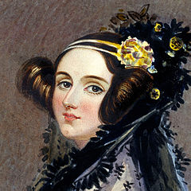

# CSE2010 Computing Science 2 Notes

## Trends in Computing Science 

**Computing Science** is the study of algorithms, including but not limited to the following: 

1. Their formal and mathematical properties. These properties are commonly referred to as **computer logic**. 

2. Their hardware applications, such as computers and everything that uses computer components. 

3. Their linguistic realization aka their *computer programming language*. 

4. Their applications.

An **algorithm** is a well ordered collection of unambiguous and effectively computable operations that, when executed, produces a result and halts in a finite amount of time. 

Note: None of these definitions rely on modern technology 

## A Brief History of Computer Science 

- before recorded time: Stonehenge is thought to be a calendar or astrological calculator. 

    

- 1700s: French mathematician *Blaise Pascal* and later, German mathematician *Gottfried Wilhem von Leibniz* invented mathematical machines that could perform basic arithmetic. 

- 1843: *Augusta Ada King, Countess of Lovelace* improves upon *Charle's Babbage's* **Analytical Engine** by inventing the algorithm loop. 

    

- 1936: *Alan M. Turing* developed the *turing machine*, which led to the development of *Colossus*, considered by many to be the first all-programmable electronic digital computer. 

- 1946: The *ENIAC* computer is unveiled. John von Neumann was a consultant on the project. The ENIAC is credited as the first modern computer. 

    
    - By the end of its operation in 1956, ENIAC contained 20k vaccum tubes, 7.2k crystal diodes, 1.5k relays, 70k resistors, 10k capaciters, and approximately 5 million hand-soldered joints. It weighted more than 30 short tons (27 tons) and filled two classrooms. 

- 1951: The UNIVAC is the first commercial computer which the US government used in their census department. 

    
    - used first generation software, where the programming language was similar to binary and programmers would program by arranging sets of zeros and ones that represented statements. 

